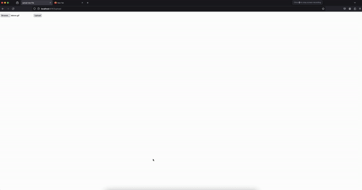

# Flask on Docker

## Summary
This repository provides both production and development environments for Flask to run on Docker utilizing Postgres. The production environment of this repository is run through Nginx and Gunicorn and allows for static and media file uploads by the user. This was developed through a tutorial by [testdriven.io](https://testdriven.io/blog/dockerizing-flask-with-postgres-gunicorn-and-nginx/)

Below is an example of uploading a file using this repositories code:
.

## Running this Repository
Below are instructions on how to run both the development and production environments of this repository.

### Development
1. Build and run the Docker containers.
```
$ docker-compose up -d --build
```
2. Create the table inside of the container.
```
$ docker-compose exec web python manage.py create_db
```
3. Check if container is running properly.
```
$ curl http://localhost:6767
```
Currently this repository is configured for port 6767 but if you choose to edit that you will need to change your curl command to reflect that.
If everything is running properly you should see an output similar to this:
```
{
"hello": "world"
}
```
4. When finished make sure you bring down the Docker containers.
```
$ docker-compose down -v
```

### Production
1. Build and run the Docker containers.
```
$ docker-compose -f docker-compose.prod.yml up -d --build
```
2. Create the table inside of the container.
```
$ docker-compose -f docker-compose.prod.yml exec web python manage.py create_db
```
3. Check if container is running properly.
```
$ curl http://localhost:6767
```
Be sure to note if the output is similar to the test output from the development steps.

4. To upload an image or media file go to this [link](http://localhost:6767/upload)

5. View your image at this link:
[http://localhost:6767/media/IMAGE_FILE_NAME](http://localhost:6767/media/IMAGE_FILE_NAME)

6. When finished make sure you bring down the Docker containers.
```
$ docker-compose down -v
```
If you receive any errors you will have to run ```docker ps``` to see which containers are still running. To remove this containers you will need to use the commands ```docker stop CONTAINER_ID``` and ```docker rm CONTAINER_ID``` to end all processes.
